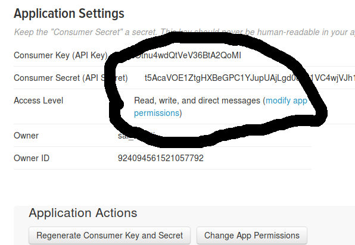
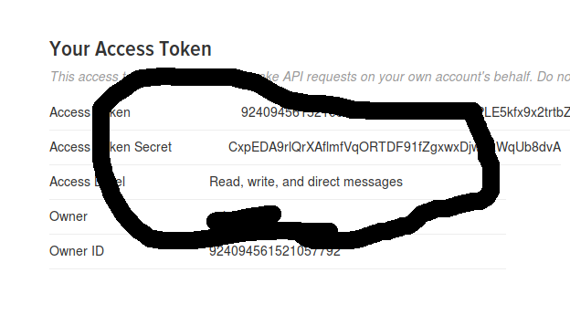

# Sending the image to Twitter.

This page describes how to publish the image from the Raspberry Pi to Twitter. 

### Prerequisites


There are few requirements to tweet a image to twitter. First one obviously to have a twitter account. The Twitter account to be created if you don't have one. 
Once you have create the twitter account, we would need the API keys for doing the tweet from the Raspberry machine. Now let's look at the steps.

#### Getting Twitter API keys
To obtain credentials (i.e. API key, API secret, Access token and Access token secret) on the Twitter developer site to access the Twitter API, following these steps:

* Create a Twitter user account if you do not already have one.
* Go to [https://apps.twitter.com/](https://apps.twitter.com/) and log in with your Twitter user account. This step gives you a Twitter dev account under the same name as your user account.
* Click “Create New App”
* Fill out the form, agree to the terms, and click “Create your Twitter application”
* In the next page, click on “Keys and Access Tokens” tab, and copy your “API key” and “API secret”. 

* Scroll down and click “Create my access token”, and copy your “Access token” and “Access token secret”.


### note: YOUR APPLICATION Access Level should have :  Read, write, and direct messages permission 

What things you need to install the software and how to install them

```
sudo pip install twython
```


